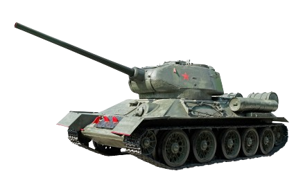
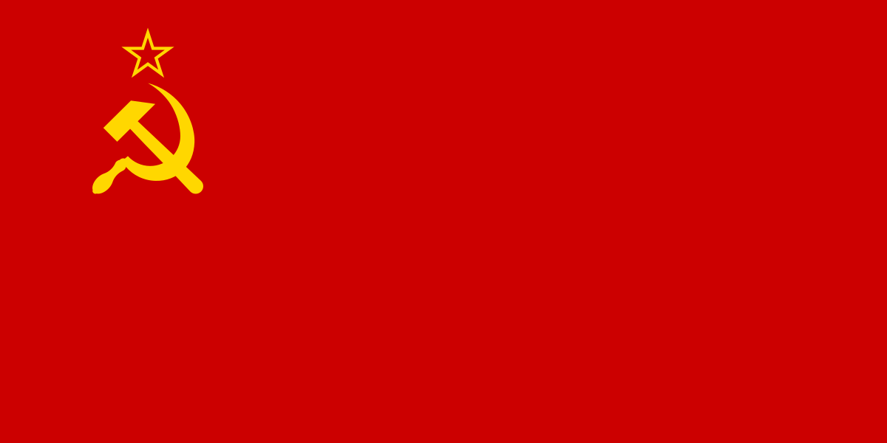
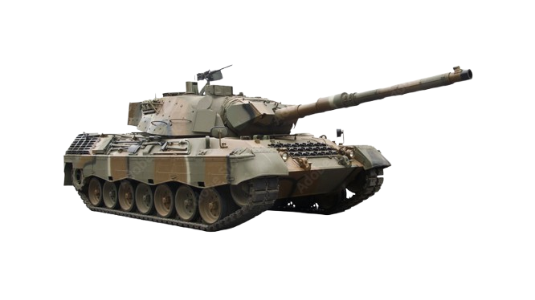

## 👀 Ez a !VIRGIN CREW! csapat oldala a harci gépekről 👀

        🚀  Itt ezen a weboldalon bemutatjuk a legismertebb,
        legkülönlegesebb harckocsikat és vadászgépeket. ✈️
        5 különféle harckocsi és 5 különféle vadászgép vannak bemutatva különböző pontokra szedve.👌

## 🙋‍♂️ Rólunk:
    4-en vagyunk alakítottuk itt a VIRGIN CREW,
    mi 4-en dolgoztunk ezen a projecten. Legjobb tudásunk szerint dolgoztunk!🎖️

    -   Nyiki Krisztián Tamás
    -   Vidéki György
    -   Szilvási Hunor
    -   Barta Sándor
    
## 🖥️ Oldal felépítése
    
    ⚖️ Az oldal 1 Main-ből és 2 branch-ből áll!
    Itt láthatóak a kód részletei:

    
## 🕹️ HTML
```html
    <tr>
                <td>T-34</td>
                <td></td>
                <td>1940</td>
                <td>1941-1945</td>
                <td></td>
                <td>Tömege: 35tonna <br>
                    Személyzet: 4-5 fő<br>
                    Elsődleges fegyverzet:<br>
                    76,2mm-es F-34, 57mm-es ZISZ-4<br>
                    L-11 Típusú harckocsiágyú<br>
                    Másodlagos fegyverzet:<br>
                    2db 7,62mm-es DT géppuska<br>
                    Teljesítmény: 500Le (12 hengeres, 38 literes vízhűtéses dízelmotor)<br>
                    Max sebesség: úton 54km/h terepen 25km/h<br>
                    Páncélzat: 45mm acél,titán.
                </td>
            </tr>


            <a href="tankos">
        
    </a>


```
    
## 🎨 CSS
```css
table{
    width: 100%;
    margin-left: auto;
    margin-right: auto;
    border: 1px solid black;
    border-collapse: collapse;

}
body{
    background-color: rgb(233, 212, 0);
}
.thead{
    background-color: rgb(0, 0, 0);
    color: rgb(233, 212, 0);
}
.head{
    background-image: url(banner.jpg);
    height: 70px;
    color: rgb(0, 0, 0);

}
tbody{
    tr:nth-child(even) {background-color: black; color: rgb(233, 212, 0);}
}
.zaszlo{
    border: 5px solid #000000;
    border-radius: 8px;
    width: 100px;
  }
.repulo{
    width: 150px;
  }
```

### 🔧 Fejlesztési lehetőségek

- [ ]  🎮 Építs egy tankot játék (Javascript hozzáadása)
- [ ]  🚩 Az elkészült tankok rangsorolása
- [x] 📱  Reszponzív megjelenítés 


## 🪢 Oldal Linkje
🏗️ [ War Machines ] ()